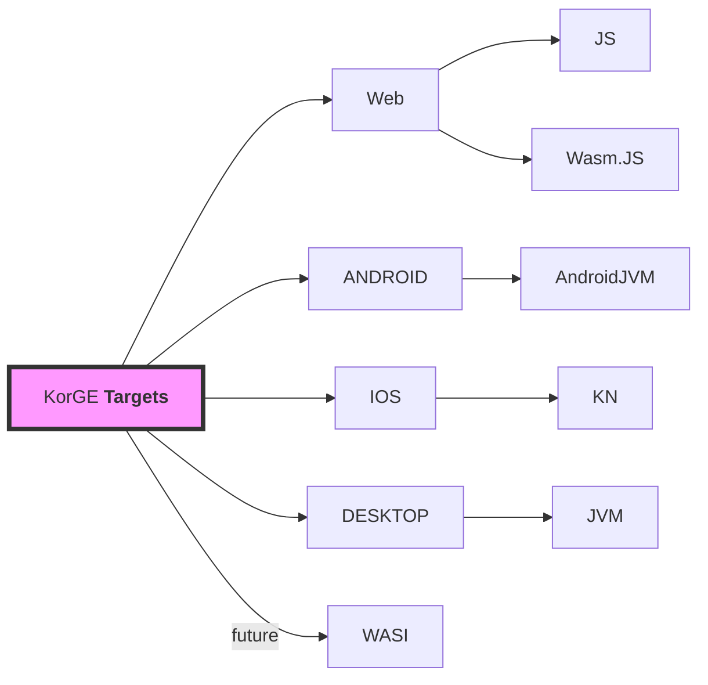

Targets:

```mermaid
flowchart LR

TARGETS["`KorGE **Targets**`"]
WEB["`Web`"]
JS["`JS`"]
WASMJS["`Wasm.JS`"]


TARGETS --> WEB
WEB --> JS
WEB --> WASMJS
TARGETS --> ANDROID
ANDROID --> AndroidJVM
TARGETS --> IOS
IOS --> KN
TARGETS --> DESKTOP
DESKTOP --> JVM
TARGETS -->|future| WASI

style TARGETS fill:#f9f,stroke:#333,stroke-width:4px

```
